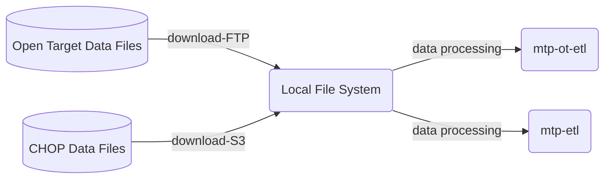

# MTP-STARTER-KIT

This repo links the "ESSENTIAL" github repositories that used for Molecular Targets Platform projects. 
The repositories as a submodule here are the core part of mtp programming ecosystem which covers data loading, data validation, configuration settings, devOps scripts, backend, front-end, etl and etc. 
To avoid the confusion, we exclued experimental repos. 

## Programming ECO-system

The MTP starts from open source project opensearch and cooperate with Children's Hospital of Philadelphia. We create repos specific for MTP, fork repos from opensources and add our customizations. We have many repos now, we categorize them into 3 groups,DATA, APPS, CI/CD. Details are list below. 

### Data 

DATA VALIDATION,ETL, DATA LOADING 

### APPS
BACKEND  & FRONTEND & CONFIGURATION

### CICD

## REPOS OVERVIEW 
