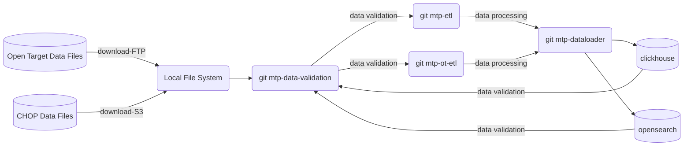
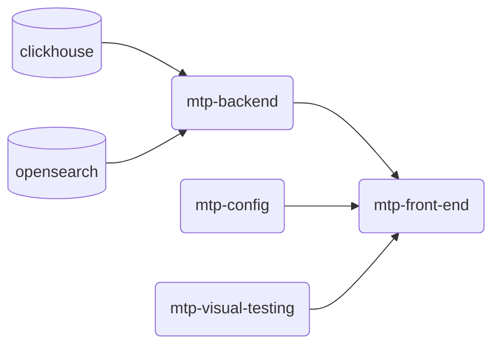

# MTP-STARTER-KIT

This repo links all "ESSENTIAL" github repositories that used for building Molecular Targets Platform APP [MTP](https://moleculartargets.ccdi.cancer.gov/). 
The repositories as a submodule here are the core part of mtp programming ecosystem which covers data loading, data validation, configuration settings, devOps, backend, front-end, etl and etc. 
To avoid the confusion, we exclued experimental repos. 
<br>


## How to use it

To get all the code used in MTP project.  You can git clone this repo then pull the submodule.
If you want to learn more about each piece, you definitely can dig into each github repository.

```

git clone https://github.com/CBIIT/mtp-starter-kit

cd mtp-starter-kit

git submodule update --init --recursive

```


## Programming ECO-system

The MTP starts from open source project opensearch and cooperate with Children's Hospital of Philadelphia. We create repos specific for MTP, fork repos from opensources and add our customizations. We have many repos now, we categorize them into 3 groups,DATA, APPS, CI/CD. Details are list below. 

<br>


## Data Processing




1. Download data files from OT and CHoP
2. Validate completeness of downloaded data , script at [mtp-data-validation](https://github.com/CBIIT/mtp-data-validation)@ main branch.
3. ETL
   * OT-ETL , script at [mtp-ot-etl(fork from OT)](https://github.com/CBIIT/mtp-ot-etl)@ main branch.
   * MTP-ETL, script at [mtp-etl](https://github.com/CBIIT/mtp-etl)@ main branch.
5. Load data into database, script at [mtp-dataloader](https://github.com/CBIIT/mtp-dataloader)@ main branch.
6. validate completeness of data on database script at [mtp-data-validation](https://github.com/CBIIT/mtp-data-validation)@ main branch.


<br>


## APPS



MTP Backend script at [mtp-backend](https://github.com/CBIIT/mtp-backend)@ main branch.

MTP Front-end script at [mtp-front-end](https://github.com/CBIIT/mtp-frontend)@ 1.1.0 branch.

MTP configuration script at  [mtp-front-end](https://github.com/CBIIT/mtp-config)@ prod branch.
The configuration settings manages GUI and versioning, connect to frontend through the API HTTP Call. 

<br>


**We will archive mtp frontend repo https://github.com/CBIIT/mtp-frontend by the end of 2022, new front-end repo is https://github.com/CBIIT/mtp-ui**


<br>


## CICD

MTP CICD's script at [ctos-cloud-devops](https://github.com/CBIIT/ctos-cloud-devops)


